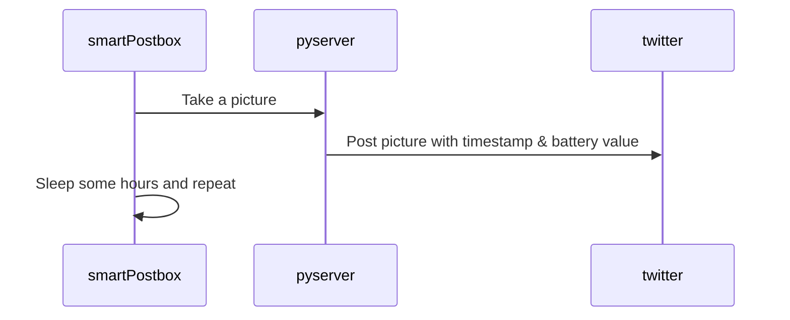

# smartPostbox

## Motivation
Like many projects out there in the wild, my motivation for this project came from stuff already laying around, things i wanted to try anyway and most important: laziness :). 
I'm a guy who hates his postbox, mostly because i continuously keep forgetting to have a look inside.

## Main idea
Create a small, self-sustaining device which takes a picture every couple of hours or so of the inside of my postbox and sends these images over an REST interface to a small Raspberry pi server, which then twitters the picture, sends an e-mail, or whatever. 
In the first interation i will take the twitter approach.

The problem can be roughly split into the following two areas:
* The smartPostbox device itself
* The server

As i am currently waiting for some of the parts, i will start with the serverside first.

## smartPostbox device
The device will consist of these parts and some smaller parts, like pullup resistors:
* ESP32 (Huzzah32 from Adafruit, for convenience)
* ArduCam mini 2MP (Also convenience)
* Step up converter (battery voltage to 5V for camera)
* Bright led for lighting up the dark postbox
* Solarpanel
* Small buffer battery (1000 mA)
* Charging electronics which handles solar power --> buffer battery --> device

## Server on Raspberry pi
The server is a very primitive one build with python and flask.
It offer an RESTful interface with only two endpoints:
* /time (method: GET)
* /picture (method: POST)

The /time endpoint is mainly for testing purposes, maybe it will come in handy in the future.
The picture endpoint receives a JSON object with the picturedata and the size of the picture.

The code can be found in the subfolder pythonRestServer, to use it you will have to type your twitter
credentials in the credentials.json file (Please avoid publishing any kind of sensitive data).

# Result
Well, we'll see when all parts have arived :)

